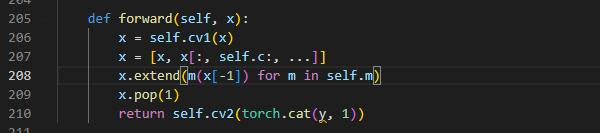
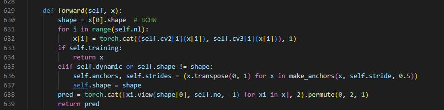
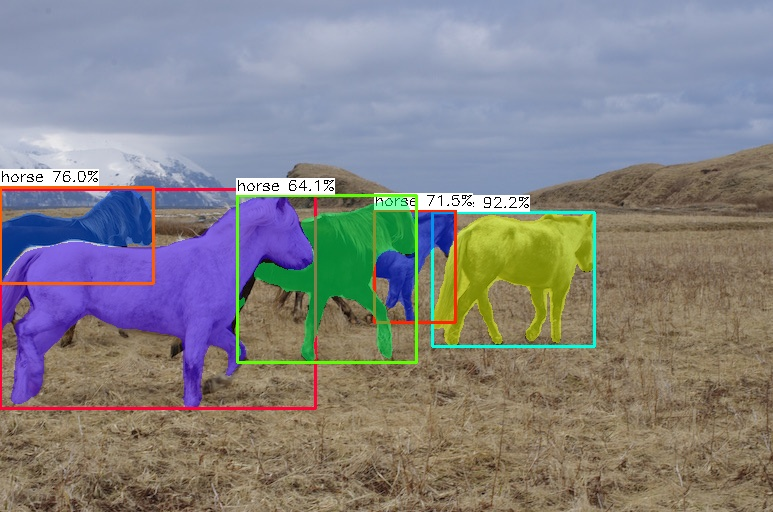

# ncnn-yolov8 detection and segmentation demo

The yolov8 object detection and segmentation

1.Android yolov8 detection demo  
2.yolov8s-seg.cpp

## convert to onnx for ncnn
1.change c2f split to slice  
  
2.change class Detect output  
  
## screenshot

## Reference：  
https://github.com/nihui/ncnn-android-nanodet  
https://github.com/Tencent/ncnn  
https://github.com/ultralytics/assets/releases/tag/v0.0.0
